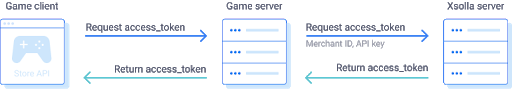

# Xsolla SDK Backend

Xsolla SDK back end is a simplified example of an authorization system for the Xsolla SDKs demo project.

The application is written in Go. Authorization is implemented via the [Pay Station access token](https://developers.xsolla.com/api/v2/pay-station/#api_payment_ui_get_token).
See the authentication algorithm on the [Developers portal](https://developers.xsolla.com/doc/in-game-store/how-to/store-api-integration/#recipes_store_api_igs_integration_set_up_auth_access_token).

## Requirements
- Golang 1.15
- Go swagger 0.25 (should be available from the console with swagger)

## Prerequisites
Register an Xsolla [Publisher Account](https://publisher.xsolla.com/signup?store_type=sdk). More instructions are on the [Xsolla Developers portal](https://developers.xsolla.com/sdk/unreal-engine/).

## Try Application
Specify the values in the **root/config/local.env** config file for the following parameters in accordance with your project in [Publisher Account](https://publisher.xsolla.com/):
- `X_PUBLISHER_API_KEY` — **API key** found in **Company settings > API key** section.
- `X_MERCHANT_ID` — **Merchant ID** found in **Project settings > Webhooks** section.
- `X_PROJECT_ID` — **Project ID** found in **Project settings > Project ID** section.
To try the application, run the make command from the root source folder:
- Use `make build` to build the application. As a result, a `web-api` binary is generated in the **cmd/web-api** folder.
- Use `make run` to run the application.

## Additional resources
- [Xsolla website](https://xsolla.com/)
- [SDKs documentation](https://developers.xsolla.com/#sdk)
